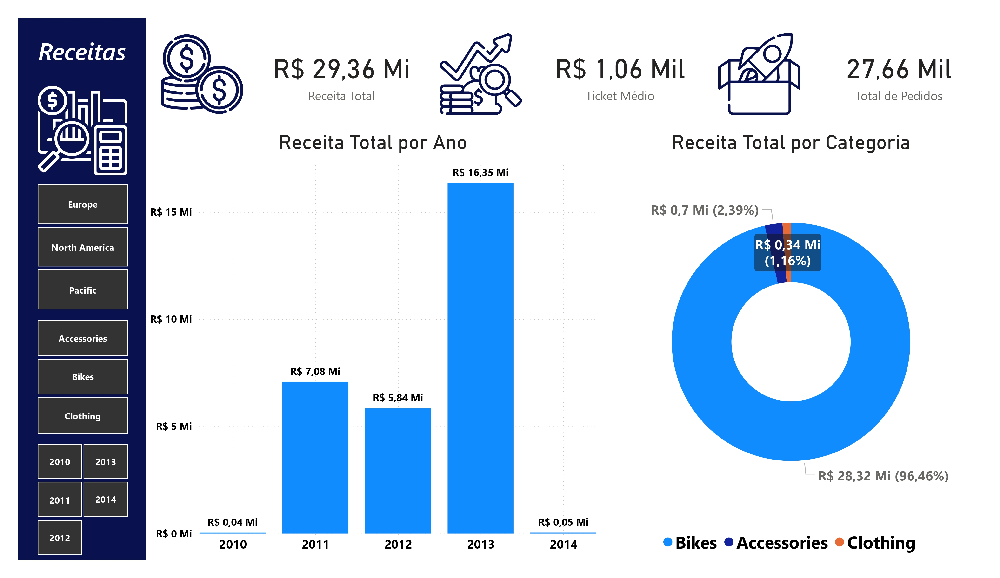

# AdventureWorks Sales Analysis

Projeto de análise de vendas utilizando o banco AdventureWorksDW2019.

## Ferramentas utilizadas

- SQL Server
- Power BI
- DAX

## Objetivo

Analisar performance de vendas por produto, região e período.

## Principais análises

- Receita total
- Ticket médio
- Top produtos
- Receita por categoria
- Receita por país
- Crescimento de vendas ao longo do tempo

## Dashboard

## Principais Insights

- A categoria Bikes representa mais de 90% da receita.
- Estados Unidos e Austrália são os mercados com maior faturamento.
- O produto Mountain-200 apresenta maior contribuição para receita.
